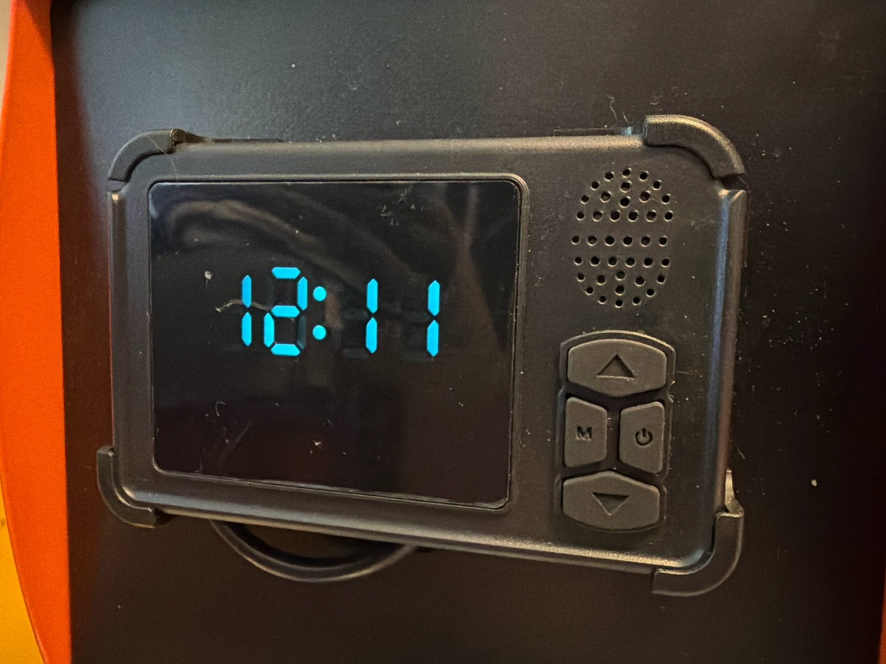

# diesel-heater-ble-macos

Control a Chinese diesel parking heater that uses the **AirHeaterBLE** app
protocol over Bluetooth Low Energy — no phone, no official app, on whatever
hardware you actually have. Three ways in, same protocol underneath.

## Is this compatible with your heater?



*The physical wired controller this repo was built and tested against —
if yours looks basically like this (same button layout, same style LCD),
that's a good visual sign, though the app name check below is the real test.*

Chinese diesel heaters get sold under dozens of storefront brand names off
a small number of shared control boards, and there are at least **four
different, incompatible Bluetooth protocols** in circulation depending on
which board/app your specific unit shipped with. This repo only implements
one of them: **AirHeaterBLE**, protocol frame markers `AA55`/`AA66`.

**Confirmed compatible** (heater's Bluetooth app is literally named
"AirHeaterBLE," or the app store listing/manual says so):
- **BYD**-branded units (this is the exact device this repo was built and
  tested against — BLE name pattern `BYD-XXXXXXXXXXXX`)
- **Vevor**

**Probably a different, incompatible protocol** (documented under other
apps/frame formats by the wider community, don't assume this repo works
without checking first): heaters using **HeaterCC** (frame marker `ABBA`),
**Sunster** (`CBFF`), or **Hcalory** (`MVP1`/`MVP2`) apps. If your heater's
app has one of those exact names, this repo is not what you want — see
[`Spettacolo83/homeassistant-diesel-heater`](https://github.com/Spettacolo83/homeassistant-diesel-heater),
which covers all four protocol families.

**How to check yours:** look at what app your heater's manual or box tells
you to install. If it's called AirHeaterBLE, you're almost certainly
compatible even if the heater is sold under some other storefront brand
name (VOR, HCALORY-adjacent knockoffs, generic Amazon/eBay "5KW diesel air
heater" listings, etc. all reuse the same handful of control boards) — the
app name is a far more reliable signal than the brand printed on the box.

Three ways to actually run it, same protocol underneath:

| Platform | Language/library | Status |
|---|---|---|
| **macOS / Linux / Raspberry Pi** | Python + [`bleak`](https://github.com/hbldh/bleak) | **Proven** — confirmed live against a real heater |
| **ESP32** | Arduino C++ + ESP32 BLE library | Unverified — protocol proven, board code not yet flash-tested |

Pick whichever fits what you've got lying around: a laptop for a quick test,
a Pi for something that just stays plugged in near the heater, or an ESP32
if you want the cheapest, lowest-power always-on option.

## Why this exists

The existing community reverse-engineering of this protocol —
[`spin877/Bruciatore_BLE`](https://github.com/spin877/Bruciatore_BLE) and the
[`Spettacolo83/homeassistant-diesel-heater`](https://github.com/Spettacolo83/homeassistant-diesel-heater)
Home Assistant integration — is built on `bluepy`, which only runs on Linux
via BlueZ. That's real, working, and native to a Raspberry Pi already — but
it left out macOS entirely, and it isn't something you can drop onto a bare
microcontroller either. This repo fills both of those gaps: a `bleak`-based
version that covers macOS (and Linux/Pi too, since `bleak` is cross-platform),
plus a from-scratch Arduino port of the same exact protocol for ESP32. All
credit for the actual protocol reverse-engineering goes to the two projects
above — everything here is about making that same protocol reachable from
more places, not re-discovering it.

## What it does

Sends the same Bluetooth commands the official AirHeaterBLE phone app sends:
power on, power off, and status. No phone required, no range limit beyond
whatever device you run this on.

## Requirements

```bash
pip install bleak
```

## Usage

```bash
python3 heater_control.py on
python3 heater_control.py off
python3 heater_control.py status
```

The heater must be powered (12V connected) and within Bluetooth range of the
machine running this script.

## Known macOS gotcha: silent Bluetooth permission hang

The first time this runs on a given machine, macOS may silently block the
scan forever instead of erroring, while it waits for an unanswered
"\<app\> wants to use Bluetooth" permission prompt — this happens especially
in headless/SSH-adjacent sessions where nobody's at the physical screen to
click it. If a scan hangs well past ~15 seconds:

- Check for the permission popup on the machine's actual screen, or
- Go to **System Settings → Privacy & Security → Bluetooth** and enable it
  manually for your terminal/app.

Once granted, it's a one-time fix — subsequent runs complete in seconds.

## Running on Linux / Raspberry Pi

Good news: **you don't need a different script.** `bleak` is cross-platform
and talks to BlueZ directly on Linux, so `heater_control.py` runs on a
Raspberry Pi (or any Linux box with a Bluetooth adapter) as-is. If you'd
rather use the original `bluepy`-based projects instead, they're
Linux-native and will also work fine on a Pi — this repo exists specifically
for the platforms those don't cover.

A few Linux-specific things worth knowing, since a Pi has no GUI to click
a permission popup on:

- Make sure BlueZ is installed and the Bluetooth service is running:
  `sudo systemctl status bluetooth` (Raspberry Pi OS has this by default).
- Unlike macOS's permission-prompt model, Linux BLE scanning typically just
  needs the right process capabilities rather than a click-through prompt.
  If you get a permission error running as a normal user, either run with
  `sudo`, or grant the capability directly so you don't have to run as root:
  ```bash
  sudo setcap 'cap_net_raw,cap_net_admin+eip' $(readlink -f $(which python3))
  ```
- For an always-on bridge sitting near the heater (the actual point of
  putting this on a Pi — a phone/laptop isn't always in range, but a Pi
  plugged in nearby always is), a small `systemd` service or your own
  cron/script wrapper works fine to call `heater_control.py` on a schedule
  or in response to some trigger; this repo intentionally doesn't assume
  what that trigger is (a Telegram bot, a webhook, a cron schedule, Home
  Assistant, etc.) since that part is genuinely specific to your setup.

## Running on an ESP32

See `esp32/` — a port of the same proven protocol to run on an ESP32
microcontroller instead of a Mac/Pi (cheaper, lower power, can stay plugged
in permanently right next to the heater). **Unverified on real hardware**
unlike the Python version — the protocol logic is proven, but the ESP32 BLE
client code itself hasn't been flash-tested yet. See `esp32/README.md`.

## Protocol notes

- GATT service: `0000ffe0-0000-1000-8000-00805f9b34fb`
- GATT characteristic (write + notify + read): `0000ffe1-0000-1000-8000-00805f9b34fb`
- Command frame: `AA 55 0C 22 <command_type> <value> 00 <checksum>`, where
  checksum is `sum(bytes[2:-1]) % 256`.
- Confirmed command types: `0x01`=STATUS, `0x02`=MODE (`0x01`=LEVEL,
  `0x02`=AUTOMATIC), `0x03`=POWER (`0x01`=ON, `0x00`=OFF — the two directly
  tested against a real device), `0x04`=LEVEL_OR_TEMP (1-10 in LEVEL mode,
  8-36°C in AUTOMATIC mode).
- **BLE addresses are not portable.** CoreBluetooth (and most BLE stacks)
  assign a synthetic address per observing device/OS — always re-scan by
  advertised name (contains `byd`, case-insensitive) rather than hardcoding
  an address from a previous run or a different machine.

## Bonus: Claude Code skill

If you use [Claude Code](https://claude.com/claude-code), `claude-skill/SKILL.md`
in this repo packages this as an invocable skill — drop it in
`~/.claude/skills/diesel-heater/` and just ask Claude to turn the heater on.

## Safety

This only sends the same start/stop commands the manufacturer's own app
sends — it doesn't add any safety feature the heater doesn't already have,
and it doesn't bypass any interlock it does have. Remote starting a
combustion heater carries real risks that have nothing to do with software:

- **Carbon monoxide.** This is the big one. A diesel heater vents exhaust
  outside, but a blocked, iced-over, snow-drifted, or improperly-routed
  exhaust pipe forces CO back into the space instead. CO is odorless,
  colorless, and it kills people who are asleep or just don't notice in
  time. **Install an independent battery- or hardwired-powered CO detector**
  in any space this heater runs in — one that doesn't depend on the same
  power/network as the heater or this script. If you're doing anything
  "smart" with this at all, wire that detector to auto-trigger the OFF
  command the moment CO is detected, don't just hope you notice an alarm
  remotely.
- **Flame-out with fuel still pumping.** If the flame goes out (wind,
  fuel starvation, a failing glow plug) but the fuel pump keeps running —
  which can happen — raw diesel keeps entering a hot combustion chamber
  instead of burning cleanly. That's the "dense white smoke" failure mode
  people report, and it is a real fire and CO risk, not just an
  inconvenience. Heaters generally have their own safety shutdowns for
  this, but don't assume software (this script included) is what's
  standing between you and that outcome.
- **Fire clearance.** Keep the heater's air intake, exhaust, and the space
  around it clear of anything flammable (fuel containers, bedding,
  cushions, dry grass, tarps) by the margin your specific heater's manual
  calls for. Don't stack or store things against it because it's "just
  sitting there off."
- **Fuel handling.** Diesel is comparatively hard to ignite versus
  gasoline, but a leaking line, a cracked tank, or fuel pooling near a hot
  surface is still a real fire hazard. Check fuel lines and connections
  periodically, especially before a season you plan to run this
  unattended a lot.
- **Unattended/remote-start specifically.** The entire point of this repo
  is starting the heater when nobody's there to watch it. That means
  nobody's there to smell smoke, see a flame-out, or notice the exhaust is
  blocked, either. Don't treat "I can start it from my phone" as
  equivalent to "someone competent is monitoring it" — pair remote starts
  with the CO detector above, and ideally a camera pointed at the unit or
  its exhaust, not blind trust that a command sent successfully means
  everything downstream of that command is fine.

None of this is exotic or unique to this project — it's the same basic
respect every diesel/propane/kerosene heater deserves whether you're
starting it by hand, an app, or a script. Use a real CO detector, don't
block the exhaust, don't leave fuel or flammables where they don't belong,
and don't be an idiot about it.

## License

MIT
